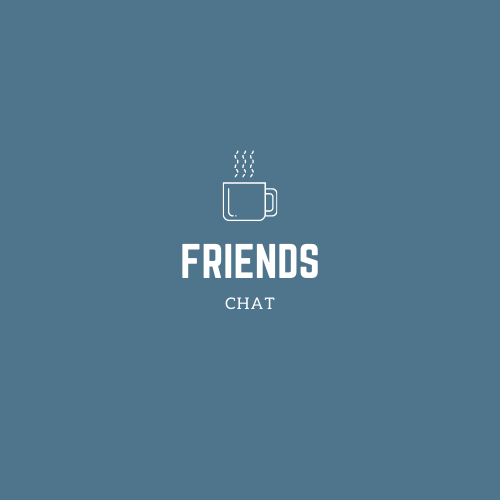

# Friends Chat

## Sobre o projeto📜

É uma aplicação web de envio de mensagens em tempo real. É possivel a criação de salas de bate papo com nome e 
número maximo de participantes personalizáveis. A aplicação utiliza websockets atravéz da biblioteca Socket.io para o envio e 
recebimento de mensagens e também para a ativação de eventos como a listagem de salas.
Projeto disponível [aqui](https://friendschat.netlify.app)

## Porque fiz esse projeto? 
Fiz esta aplicação para avançar nos meus estudos de nodejs e para aprender a utilizar a biblioteca socket.io.

## Tecnologias

- JavaScript
- ReactJS
- Socket.io

## Minhas redes🌐

